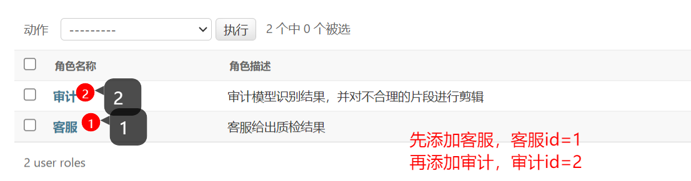
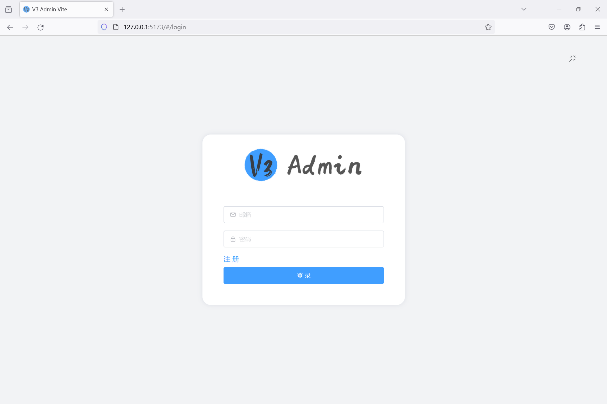
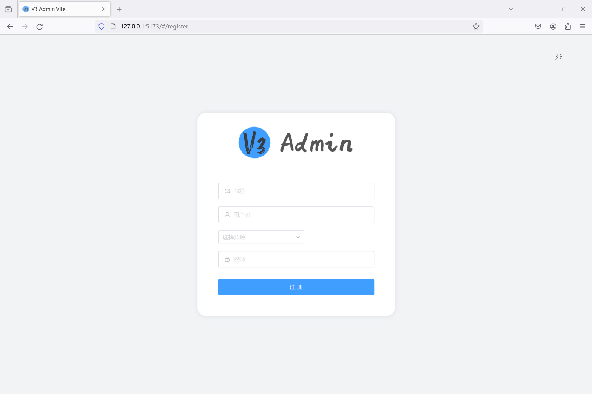
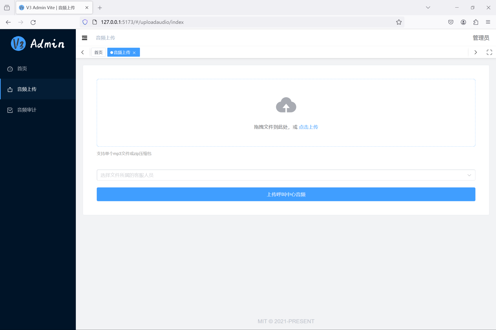
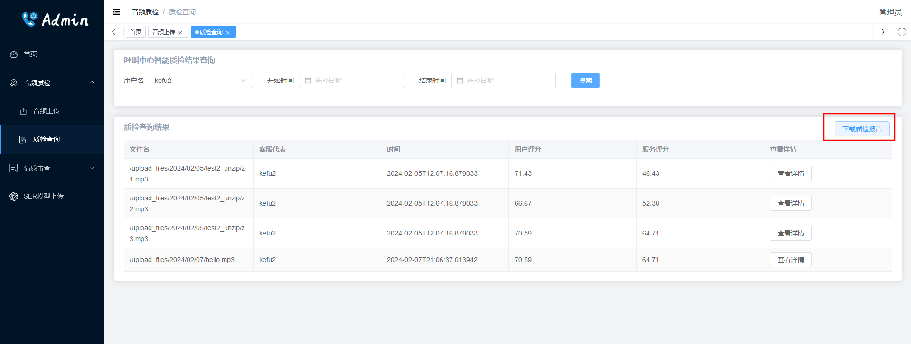
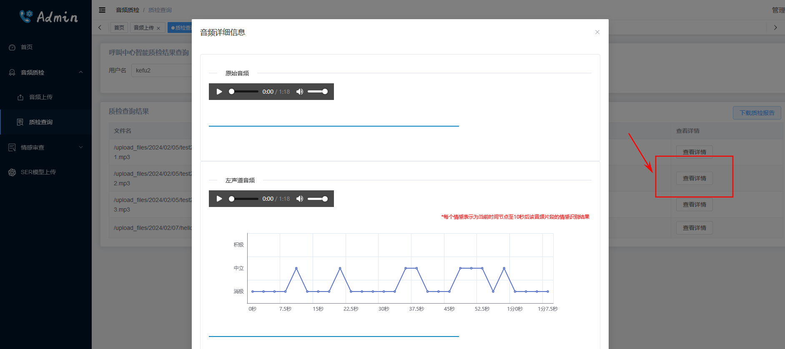
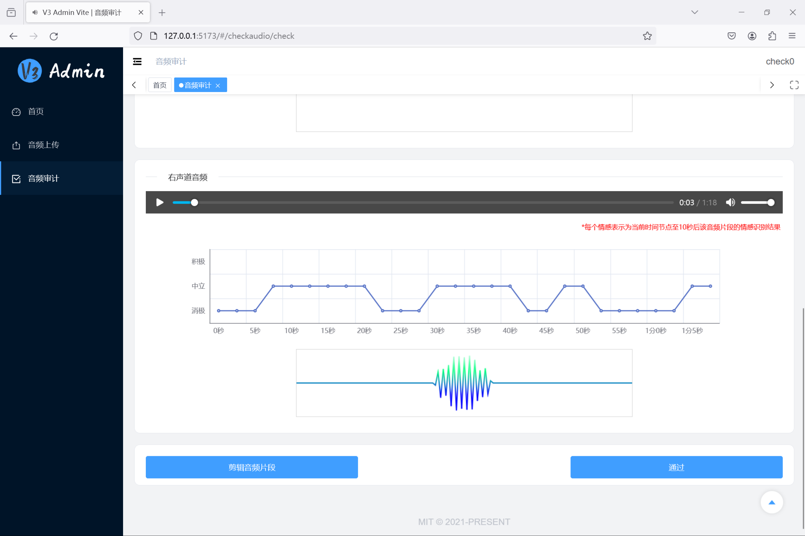
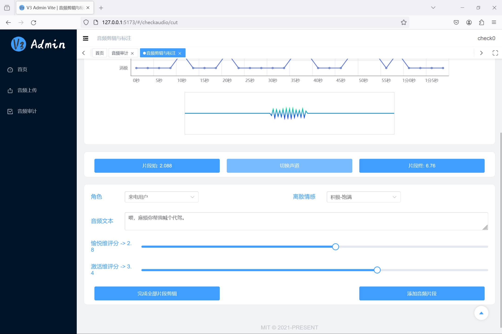
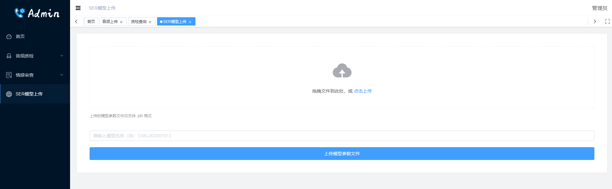

# CallCenter-EMO

> 本项目用于呼叫中心的语音情感识别系统，前端使用Vue，后端使用Django开发API，主要分两个功能模块：1. 管理员上传呼叫中心业务音频，后台自动进行情感识别；2. 审查模型情感识别结果，将不合理的片段剪辑出来，并对情感进行标注，已壮大原始训练的语料库。

> 🚩管理员账户才可以上传音频，客服用户不使用该系统，仅展示不同客服的质检评分，审查用户不能上传音频，只需要在本系统上对音频进行审查和剪辑即可。

## 一、使用说明

### 安装环境(这里以Fedora系统为例)

安装前置依赖
```shell
# fedora
sudo dnf install mysql-devel ffmpeg

# debian
sudo apt install libmariadb-dev ffmpeg
```
> 🚨 AI 提示可以使用以上命令安装 `ffmpeg` ，但我没有成功，提示没有这个包，可以访问[ffmpeg官网](https://ffmpeg.org/download.html)复制命令下载源码，然后参考这篇[CSDN博客](https://blog.csdn.net/PYJTRK/article/details/122846864)通过源码编译安装

克隆本仓库
```shell
git clone https://github.com/KunCheng-He/callcenter-emo.git
```

安装 `python` 环境 和 `nodejs`，推荐使用 `nvm` 来安装 `nodejs`，`python` 推荐使用 `conda` 进行创建，我使用的版本是 `3.10.13`，你可以执行 `conda create -n cc-emo python=3.10` 来创建环境，之后执行 `conda activate cc-emo` 来激活环境，再执行以下命令来安装依赖
```shell
pip install -r requirements.txt

nvm install 18.19.0
cd v3-frontend
npm install -g pnpm
pnpm i
```
以上命令如果提示 `torch` 等安装存在问题，可以将 `requirements.txt` 中的 `torch` 和 `torchaudio` 删除后再运行，这两个包可以通过以下命令单独安装
```shell
pip install torch==2.0.0 torchaudio==2.0.1 --index-url https://download.pytorch.org/whl/cpu
```

### 数据库配置

启动项目需要配置 `mysql` 和 `redis` 数据库，配置模板文件在 `/callcenter_emo/config-demo.py` 下，执行以下复制命令，在 `config.py` 文件中填写你自己的数据库配置（📌如果你还有创建数据库服务，请先安装对应的数据库服务，可以通过 `docker` 命令快速的启动数据库服务，具体命令这里不再详细赘述）
```shell
cd callcenter_emo
cp config-demo.py config.py
vim config.py
```
> `mysql` 数据库用于存储系统数据，`redis` 数据库是使用 `celery` 库在后台执行异步任务时需要。🚩特别提醒，系统访问数据库的网络需要保持稳定，不然 `celery` 再执行任务时可能因为网络不稳定而出现问题，我是在同一台机器里通过 `docker` 提供这两个服务。

### 情感识别模型参数

> 📌进入系统后务必先上传模型参数文件，之后再上传音频文件进行识别📌📌📌

### 启动项目

以上都操作完成后，可以启动项目

```shell
# 初始化数据库与创建系统管理员
python manage.py makemigrations
python manage.py migrate
python manage.py createsuperuser

# 启动 celery 后台任务
celery -A cc_celery.main worker --loglevel=info

# 启动 django 项目
python manage.py runserver 0.0.0.0:8000

# 启动前端项目
cd v3-frontend
pnpm dev
```
> 💡至此，没有意外的话，整个项目就启动完成了，后端端口为 `8000`，前端端口为 `5173`

### 创建用户角色

本项目现阶段在设计上还存在问题，前端在判断用户是否可以审计音频时，是通过判断用户的角色ID来确定的，所以我们需要先进入 `Django` 的 `admin` 后台，按序创建两个用户角色


> 🌈🌈🌈执行到这，整个项目的基本设置就完成了，可以访问前端页面了

## 二、系统页面展示

+ 登录与注册




+ 主页


+ 上传音频



+ 质检查询与质检报告下载




+ 审查与剪辑(下图为前版系统，页面在当前系统的情感审查目录下，页面为改动，不重新截图)




+ 模型上传页面



### 三、暂时存在的问题

+ Chrome 音频播放器可能显示不正常
+ 系统前后端逻辑存在一些问题，需要进一步完善
+ 上传中文命名的文件有Bug
+ 略

### 四、致谢

+ 本项目前端通过 [un-pany/v3-admin-vite](https://github.com/un-pany/v3-admin-vite) 模板修改而来，在此表示感谢
+ 前端使用 [staskobzar/vue-audio-visual](https://github.com/staskobzar/vue-audio-visual) 组件来展示音频播放器与波形图，感谢该组件作者 [staskobzar](https://github.com/staskobzar) 帮助解决问题：[issue1](https://github.com/staskobzar/vue-audio-visual/issues/148) [issue2](https://github.com/staskobzar/vue-audio-visual/issues/149)，十分感谢
+ 略
